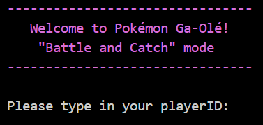
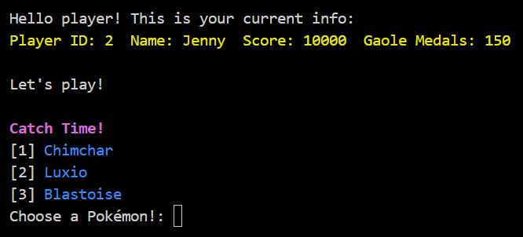
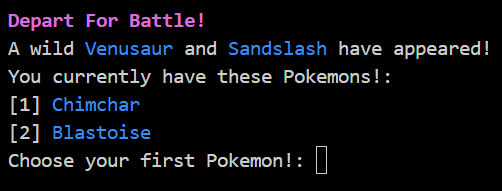
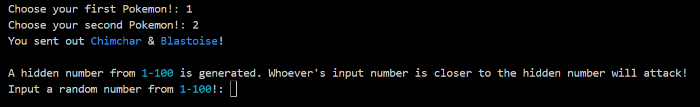
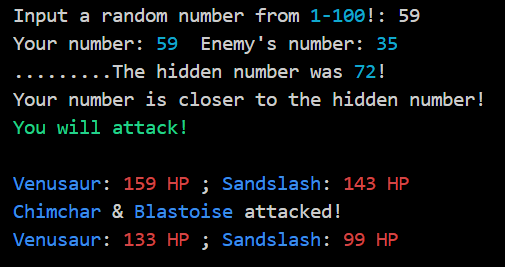
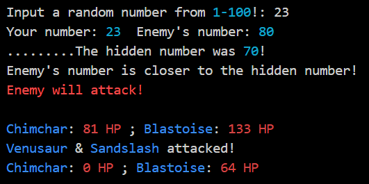
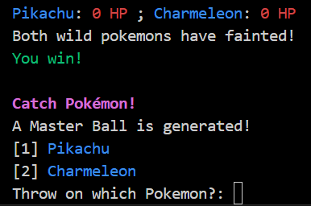
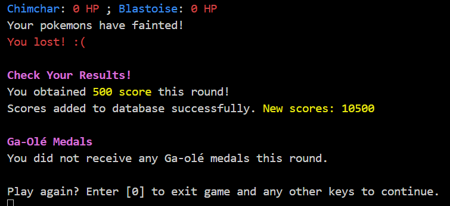
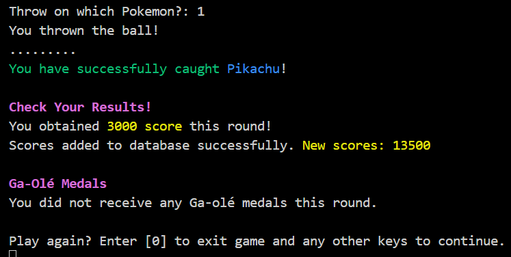
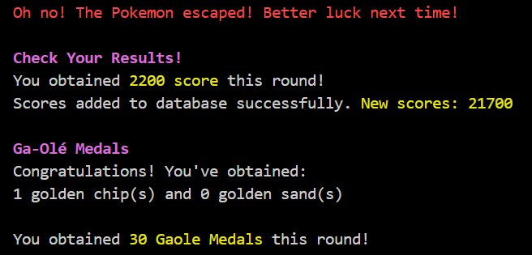

# About

<h4>A fun and simple Java console program that imitates the Pokémon Ga-Olé arcade game - Battle and Catch mode. 🕹️</h4>
<h4>This project is done in collaboration with:</h4>
<ul>
	<li>Chan Kah Gin</li>
	<li>Lee Wen Xuan</li>
	<li>Ho Zi Shan</li>
	<li>Ilyana Sofiya Binti Muhammad Najeli</li>
</ul>

## How to Play

The game starts off by asking you to first select a valid player ID in the resources/player.txt file. More players need to be added and initialised manually in the src/Game.java file (unfortunately).

As of today, there are only 6 player IDs to choose from (1-6). Each owns different Pokémon.

Pokémon Initially Owned:

<ul>
	<li>Player 1: Greninja, Pikachu, Garchomp</li>
	<li>Player 2: Chimchar</li>
	<li>Player 3: None</li>
	<li>Player 4: Rowlet, Bayleef, Blastoise, Pikachu</li>
	<li>Player 5: Charmeleon, Luxray</li>
	<li>Player 6: Greninja, Infernape, Sandslash</li>
</ul>

After choosing a player, the first game phase starts - Catch Time!

3 random Pokémon from the pool of 20 Pokémon (more to be hopefully added in the future) are chosen. Pick one Pokémon to add it into the owned Pokémon list!

Now you are ready for battle, the second game phase starts - Depart For Battle!

Two wild Pokémon will appear. Pick two Pokémon from your list of owned Pokémon to fight them!

Do not worry if you are poor (like me) and do not have enough Pokémon. A random Pokémon will be rented to you to fight them!

Once you get your two Pokémon out, you will start to play RNG with the computer.

A random 'hidden number' from 1-100 will be generated. You have to enter a random number of your own from 1-100. The goal here is to get your number to be as close as possible to the hidden number!

The computer itself will generate another number, and if this number is closer to the 'hidden number' than yours, the computer (the wild Pokémon) will attack first, and vice versa.

Whoever that attacks will have their two Pokémon attack the other two at the same time. The total damage done to each Pokémon is calculated using a formula based on type weaknesses and their individual stats.

Winning the RNG:

Losing the RNG:

If 2 of the wild Pokémon faints (0 HP), you win! You will then move on to the third game phase - Catch Pokémon!

If 2 of your Pokémon faints, you lose! You skip the third game phase and end the game with your results saved.

Back to the Catch Pokémon! phase, you will get a random Pokéball (Poké Ball, Great Ball, Ultra Ball, or Master Ball) and you will be given a chance to catch one of the wild Pokémon.

The chance of the Pokémon being caught is also calculated by a formula based on the Pokémon level and the type of ball used. If you catch it successfully, you get to add it to your owned Pokémon list!

The game then ends with your results saved.

What if the Pokémon escapes? You won't get the Pokémon, but you get Ga-Olé medals instead!

The amount of medals you get depends on the level of the Pokémon escaped. The higher the Pokémon level, the more your medals.

These medals can be accumulated, and when you reach a total of 160 Ga-Olé medals, it will be exchanged for a random boost item (Attack, Defense or Pokeball Power), which can be used when playing the next round!

## Upcoming (hopefully)

This program can definitely be further improved in the future. Maybe more Pokémon, better battling system, better players info saving.

We (probably) need moral support. Programming is not easy :(

